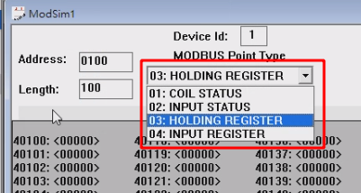
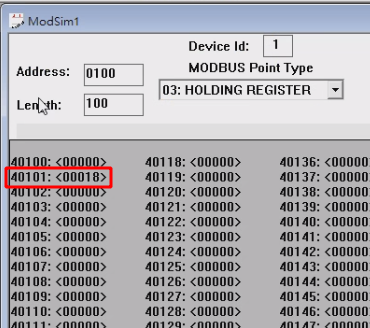

# Modbus POC

prerequisite: `launchpadlib` and `pymodbus==2.5.3`

## Server and Client

Start a server

```
cd experiment

python server.py
python Modbus_client.py
```

## Work with Modsim32

Choose 03: Hold register



```
python3 write.py
```



Here is the setting info.

- Address: 0100
- Length: 100
- Device ID: 1
- 03: Holding register

## Reference

- https://hackmd.io/@Chieh/Hkwbx14OT
